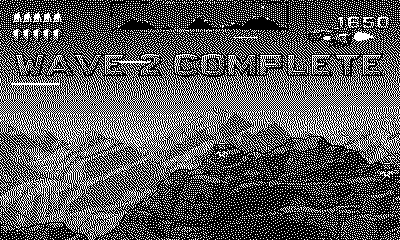

# Avenger

Defend the colonists across a wrapping world. *(Code the Classics Volume 2)*

## Controls

- Up/Down — altitude
- Left/Right — face and thrust (momentum)
- A — fire
- B — instant reverse
- Crank — fine altitude trim

## How it plays

Landers drop from the sky to abduct your colonists — shoot the
abductor and catch the falling human before the ground does, then
set them down gently. Lose one to the top of the sky and it returns
as a fast, angry mutant. Pods burst into swarmers; baiters punish
camping. The radar strip shows the whole wrapping world. Rescue all
ten across a wave for the token bonus.

---

Part of [Classics](../../README.md) — `make avenger` from the repo root
builds it; a ready-to-play copy ships in [`dist/`](../../dist/).
