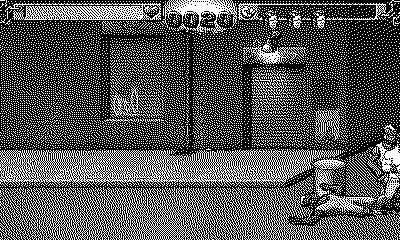

# Beat Streets

Two stages of streets that need cleaning. *(Code the Classics Volume 2)*

## Controls

- D-pad — walk the street (8-way, with depth)
- A — punch (tap repeatedly for the combo)
- B — kick; B with a direction — jump kick

## How it plays

Walk right until the GO arrow locks you into a wave, then put the
thugs down — punches chain into an uppercut, kicks knock down, and
only a couple of enemies will engage you at once if you keep moving.
Barrels break open into health. Each stage ends with a heavy who
takes a lot of convincing. Two stages between you and the win
screen.

---

Part of [Classics](../../README.md) — `make beatstreets` from the repo root
builds it; a ready-to-play copy ships in [`dist/`](../../dist/).
