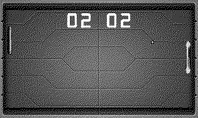

# Boing

Table tennis with a crank for a bat. First to 10. *(Code the Classics Volume 1)*

## Controls

- 1 player — crank or d-pad (up/down) moves your bat
- 2 players, one Playdate — player 1 on the d-pad, player 2 on the crank
- A — serve / confirm

## How it plays

The ball speeds up with every hit and deflects by where it strikes
the bat — catch it with the edge to send it off at an angle. The AI
tracks with a deliberate wobble of error, re-rolled every exchange.
Hit sounds layer and intensify with ball speed, exactly as the rally
starts to feel dangerous. First to ten takes the table.

---

Part of [Classics](../../README.md) — `make boing` from the repo root
builds it; a ready-to-play copy ships in [`dist/`](../../dist/).
