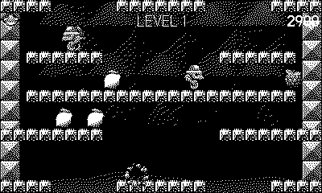

# Cavern

Trap the robots in orbs, pop them into fruit. *(Code the Classics Volume 1)*

## Controls

- D-pad — run
- A — jump
- B — blow an orb (hold to inflate it bigger and further)

## How it plays

Single-screen platform levels that wrap top to bottom. Blow orbs to
trap the patrolling robots — trapped, they float; popped, they turn
into fruit worth 100/200/300. The aggressive robots shoot bolts and
breathe fire, and they're the only ones that drop hearts and extra
lives. Fruit rains in periodically; levels cycle through four cavern
layouts with rising robot counts and fire rates.

---

Part of [Classics](../../README.md) — `make cavern` from the repo root
builds it; a ready-to-play copy ships in [`dist/`](../../dist/).
