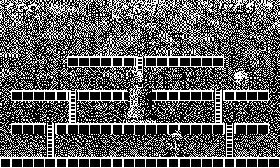

# Eggzy

Grab every gem before the clock does you in. *(Code the Classics Volume 2)*

## Controls

- D-pad — run and climb ladders
- A — jump

## How it plays

Single-screen platform layouts with a countdown clock: gems add
time, the exit opens when the level is clear, and finishing banks a
bonus for every second you didn't need. Walkers patrol the platforms
and flyers patrol the air. The clock is tight by design — collect in
smooth lines or don't bother. Lives are lost to enemies and to the
clock alike.

---

Part of [Classics](../../README.md) — `make eggzy` from the repo root
builds it; a ready-to-play copy ships in [`dist/`](../../dist/).
