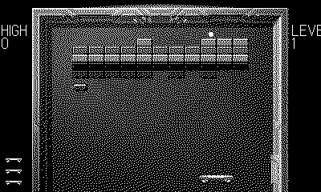

# Kinetix

A brick-breaker with the crank as the bat. *(Code the Classics Volume 2)*

## Controls

- Crank — move the bat (primary)
- D-pad — fallback movement
- A — serve / release a held ball / fire the gun powerup

## How it plays

Six mirrored arenas of bricks: armored ones take two hits, metal
ones yield only to time. Capsules fall from broken bricks — extend,
gun, magnet, multiball, slow, fast, portal, extra life — and the
portal is the only exit: finish the level by riding the bat out
through it. The ball gains pace the longer you neglect it.

---

Part of [Classics](../../README.md) — `make kinetix` from the repo root
builds it; a ready-to-play copy ships in [`dist/`](../../dist/).
