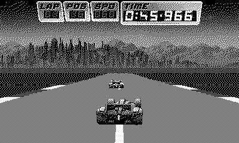

# Leading Edge

Twenty cars, one racing line, crank to steer. *(Code the Classics Volume 2)*

## Controls

- Crank — steering (primary)
- D-pad — full-lock fallback
- A — accelerate
- B — brake

## How it plays

A full circuit racer from the grid: twenty cars, corner speed caps,
rumble strips, and rivals that lean into corners and trade paint.
Three laps against a 240-second limit, with your fastest lap and
race time saved as records. The start is staggered — work through
the field; the leaders don't wait.

---

Part of [Classics](../../README.md) — `make leadingedge` from the repo root
builds it; a ready-to-play copy ships in [`dist/`](../../dist/).
