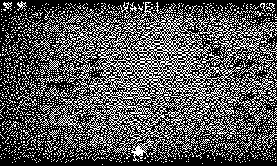

# Myriapod

Hold the bottom of the garden against the chain. *(Code the Classics Volume 1)*

## Controls

- D-pad — fly (free movement in the lower zone)
- Hold A or B — autofire
- Crank — fine horizontal nudge

## How it plays

The myriapod marches cell to cell through the rock field, dropping
a row each time it turns. Shoot a middle segment and the chain splits
— every segment you kill hardens into a fresh rock. Bees chip rocks,
flies seed them, and the spider eats them while zigzagging at you.
Clear every segment to advance; every fourth wave comes fast and
armored. Extra life every 10,000.

---

Part of [Classics](../../README.md) — `make myriapod` from the repo root
builds it; a ready-to-play copy ships in [`dist/`](../../dist/).
