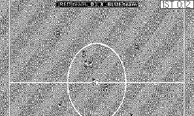

# Soccer

Seven-a-side, no keepers, no mercy. *(Code the Classics Volume 1)*

## Controls

- D-pad — run (you control the player nearest the ball, marked by the arrow)
- Hold A — charge a kick; release to pass or shoot (control follows a pass)
- B — switch player manually

## How it plays

Top-down football on a scrolling pitch. Dribble at your feet, time
the tackle by running through the carrier, and thread passes — the
receiving teammate becomes yours. Two 90-second halves on the match
clock, kickoffs after goals, open goals at both ends, and two
difficulty levels of opposition AI that positions, marks, and shoots.
Your win/draw/loss record persists.

---

Part of [Classics](../../README.md) — `make soccer` from the repo root
builds it; a ready-to-play copy ships in [`dist/`](../../dist/).
